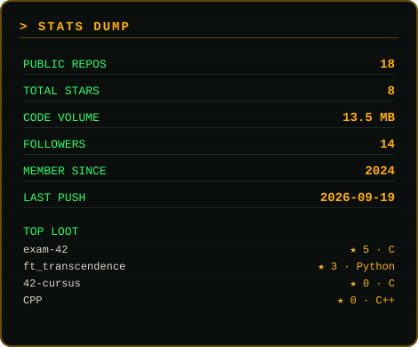
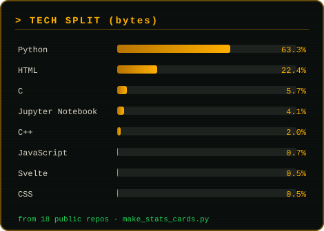

<!-- ═══════════════════════════════════════════════════════════════════════════
     MEHDI MOUAFFAK — CRT / PHOSPHOR PROFILE TERMINAL
     Fichiers à déposer tels quels dans le repo Mehdo0/Mehdo0 :
       1. README.md                (ce fichier, à la racine)
       2. assets/crt-banner.svg    (bannière animée maison)
       3. assets/crt-divider.svg   (séparateur animé)
       4. .github/workflows/snake.yml (le snake qui mange le graphe de contributions)
     ══════════════════════════════════════════════════════════════════════════ -->

<div align="center">



<br/>

<a href="https://github.com/Mehdo0">
  
</a>

<br/>

**🇫🇷 Je cherche un stage de 6 mois — disponible immédiatement, convention 42 Lausanne.**
<br/>
**🇬🇧 Looking for a 6-month internship — available immediately.**

<br/>

<a href="mailto:mmouaffa@student.42lausanne.ch"></a>
<a href="https://www.linkedin.com/in/mehdi-mouaffak"></a>
<a href="https://mehdo0.github.io/portfolio/"></a>
<a href="https://github.com/Mehdo0?tab=repositories"></a>


</div>



## `> whoami`

```console
┌─[ root@42lausanne ]─[ ~/profile ]
└──╼ $ cat identity.txt

  NAME      Mehdi Mouaffak
  BASE      42 Lausanne — Renens, Switzerland
  ROLE      Full-stack developer · C systems · security-minded
  CURSUS    Common core COMPLETED — next: 6-month internship
  WEAPONS   C / C++ · Python · TypeScript · Bash
  ARSENAL   FastAPI · SvelteKit · Docker · Nginx · Linux · Git · Playwright · Stripe
  SIDE-LOAD Cybersecurity (OWASP, CTF, bug bounty) · concurrent systems · applied ML
  MINDSET   No lectures, no safety net — you read, you build, you review, you ship.
```

<div align="center">

## `> SELECT YOUR SAVE FILE`

</div>

| | Project | Stack | Status |
|:--:|:--|:--|:--|
| 🕹️ | **[ft_transcendence](https://github.com/Mehdo0/ft_transcendence)** · full-stack multiplayer gaming platform | SvelteKit · FastAPI · Docker · Nginx · WebSockets | ⭐ 3 · shipped, team of 4 |
| 💾 | **[exam-42](https://github.com/Mehdo0/exam-42)** · 42 exam solutions & drills, ranks 3→5 | C · C++ | ⭐ 5 · most starred |
| 🧠 | **[SEO Tools](https://github.com/Mehdo0/seo-tools)** · SEO audit SaaS + B2B scraping engine | FastAPI · Playwright · Manifest V3 · Stripe | 🟢 SaaS, 76 tests |
| 🛡️ | **[VulnForge](https://github.com/Mehdo0/vulnforge)** · AI multi-agent pentest platform | FastAPI · SvelteKit · LLM agents | 🟠 in development |
| 📦 | **[Inception](https://github.com/Mehdo0/Inception)** · multi-container infra from scratch | Docker · Nginx · MariaDB · TLS | ✅ 42 validated |
| 🗡️ | **[cube3D](https://github.com/Mehdo0/cube3d)** · Wolfenstein-style raycasting engine written from zero | C · MiniLibX · raycasting | ✅ 42 validated |
| ⚙️ | **[Philosophers](https://github.com/Mehdo0/philosophers)** · dining philosophers, no deadlock allowed | C · threads · mutexes · semaphores | ✅ 42 validated |
| 🐍 | **[snake_game_ai](https://github.com/Mehdo0/snake_game_ai)** · AI that learns to beat Snake | Python · reinforcement learning | 🧪 experiment |
| 🌐 | **[portfolio](https://mehdo0.github.io/portfolio/)** · personal site, hand-written | HTML · CSS · JS · GitHub Pages | 🟢 live |

<details>
<summary><b>⌨️ 42 CURSUS — PROGRESSION LOG</b> (clique pour dérouler)</summary>

<br/>

```console
PISCINE (2024)            ████████████████████  100%   ✓ validated
LIBFT / MAKE-BASED        ████████████████████  100%   ✓ validated
PUSH_SWAP                 ████████████████████  100%   ✓ validated
PIPEX                     ████████████████████  100%   ✓ validated
PHILOSOPHERS              ████████████████████  100%   ✓ validated
CUBE3D                    ████████████████████  100%   ✓ validated
CPP 00 → 09               ████████████████████  100%   ✓ validated
INCEPTION                 ████████████████████  100%   ✓ validated
FT_TRANSCENDENCE          ████████████████████  100%   ✓ validated, team of 4
COMMON CORE               ████████████████████  100%   ✓ COMPLETED

NEXT BOSS   →  6-month internship · convention 42 Lausanne · available now
```

</details>


<div align="center">

## `> STATS DUMP`





<br/>

<sub>Cartes ci-dessus générées depuis l'API GitHub par <code>scripts/make_stats_cards.py</code> (relance-le pour les rafraîchir).</sub>

</div>


<div align="center">

## `> FINAL BOSS: CONTRIBUTION SNAKE`

<picture>
  <source media="(prefers-color-scheme: dark)" srcset="https://raw.githubusercontent.com/Mehdo0/Mehdo0/output/snake-dark.svg?v=2" />
  
</picture>

<sub>Serpent régénéré toutes les 12 h par <code>snake.yml</code> · variante claire / sombre automatique · le graphe se remplit à mesure que les contributions tombent.</sub>

</div>


## `> TECH INVENTORY`

<div align="center">

**LANGUAGES**


**BACKEND / FRONTEND**


**INFRA / SECURITY / ML**


</div>


## `> INSERT COIN — CONTACT`

```console
└──╼ $ contact --fastest

  EMAIL      mmouaffa@student.42lausanne.ch
  LINKEDIN   linkedin.com/in/mehdi-mouaffak
  PORTFOLIO  mehdo0.github.io/portfolio
  STATUS     AVAILABLE — 6-month internship, immediately, 42 Lausanne agreement

└──╼ $ _
```

<div align="center">


<sub><b>PRESS START TO CONTINUE</b> · ▓▒░ CRT PHOSPHOR P3 · 60 Hz · 1 CREDIT ░▒▓</sub>

</div>